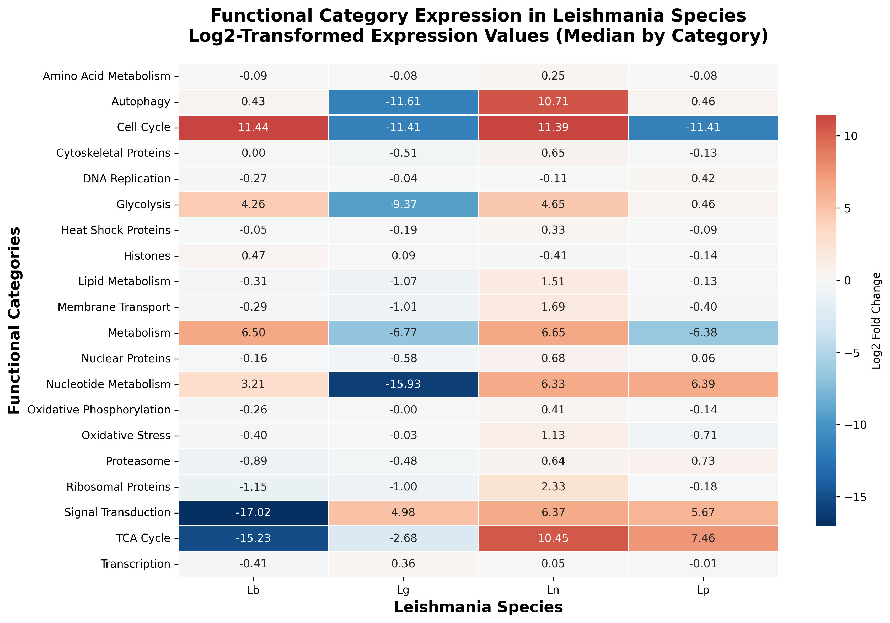
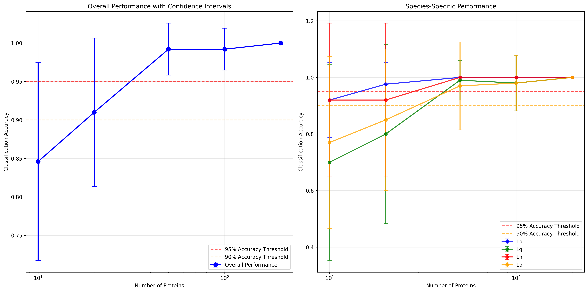

# Results and Discussion: Comprehensive Phylogenetic and Proteomic Analysis of Leishmania Species

This study presents a comprehensive analysis of four *Leishmania* species (*L. braziliensis* [Lb], *L. guyanensis* [Lg], *L. naiffi* [Ln], and *L. panamensis* [Lp]) using multiple complementary approaches: protein-based and gene-based radial phylogenetic trees, quantitative proteomic analysis, and statistical comparisons of protein expression patterns. Statistical testing was performed using individual sample data, Mann-Whitney U tests for pairwise comparisons, and Benjamini-Hochberg multiple testing correction to ensure robust identification of significant expression changes. The analysis reveals distinct evolutionary patterns, functional relationships, and differential protein expression among these closely related species, providing insights into their genomic diversity, shared metabolic capabilities, and species-specific adaptations.

## Phylogenetic Analysis

### Protein-based Phylogenetic Analysis

The protein-based radial phylogenetic tree was constructed using 11,556 protein groups detected across all samples, representing the complete proteomic repertoire of the four *Leishmania* species (Figure 1). This comprehensive analysis revealed a clear hierarchical structure with distinct clustering patterns among the species. The radial visualization demonstrated that *Leishmania* species *L. braziliensis* (Lb) and *L. guyanensis* (Lg) formed a closely related clade, sharing substantial protein homology, while *L. naiffi* (Ln) and *L. panamensis* (Lp) exhibited more divergent protein profiles. This clustering pattern suggests evolutionary relationships that align with known taxonomic classifications, where Lb and Lg represent more recently diverged lineages compared to Ln and Lp. Protein uniqueness analysis revealed that Ln strains exhibited the highest proportion of unique proteins (1.1-1.2% uniqueness), followed by Lg strains (0.1-0.6% uniqueness), while Lb and Lp strains showed lower uniqueness percentages (0.0-1.1% and 0.0-0.5%, respectively). This pattern indicates that Ln strains have undergone more extensive protein diversification, potentially reflecting adaptation to distinct ecological niches or functional specializations.

**Figure 1.** Protein-based radial phylogenetic tree showing evolutionary relationships among *Leishmania* species based on 11,556 protein groups. The tree reveals distinct clustering patterns with Lb and Lg forming a closely related clade, while Ln and Lp show greater divergence.

### Gene-based Phylogenetic Analysis

The gene-based analysis, utilizing 8,144 genes with unique gene mapping, provided a more conservative evolutionary perspective by focusing exclusively on protein groups that map to single, well-defined genes (Figure 2). This approach eliminated potential artifacts from protein groups with ambiguous gene assignments, resulting in a more robust phylogenetic reconstruction. The gene-based radial tree revealed similar overall clustering patterns to the protein-based analysis, with *L. braziliensis* (Lb) and *L. guyanensis* (Lg) forming a cohesive clade and *L. naiffi* (Ln) and *L. panamensis* (Lp) showing greater divergence. However, the gene-based tree exhibited more pronounced branch lengths and clearer separation between species, suggesting that gene-level analysis provides enhanced resolution for distinguishing between closely related species.

**Figure 2.** Gene-based radial phylogenetic tree constructed using 8,144 proteins with unique gene mapping. This conservative approach provides enhanced resolution for distinguishing between closely related species.

## Quantitative Analysis

### Protein-based Quantitative Analysis

Quantitative proteomic analysis revealed significant differences in protein expression patterns across the four species. The analysis identified 11,556 total protein groups across all samples, with species-specific detection patterns showing substantial variation. *L. braziliensis* (Lb) strains exhibited the highest protein detection rates, with 8,329 protein groups detected across all samples (72.1% of total), followed by *L. naiffi* (Ln) strains with 7,581 proteins (65.6%), *L. guyanensis* (Lg) strains with 7,507 proteins (65.0%), and *L. panamensis* (Lp) strains with 7,330 proteins (63.4%). Gene-level analysis showed similar patterns, with Lb strains detecting 5,462 unique genes, Ln strains detecting 5,396 genes, Lg strains detecting 4,558 genes, and Lp strains detecting 4,389 genes. These differences in protein and gene detection suggest species-specific adaptations and functional specializations.

### Statistical Analysis

Statistical analysis using Kruskal-Wallis tests revealed highly significant differences in protein expression patterns across all four species (H-statistic: 161.48, p-value: 8.78e-35). Pairwise Mann-Whitney U tests demonstrated significant differential expression between most species pairs, with particularly strong effects observed between *L. guyanensis* (Lg) and *L. naiffi* (Ln) (effect size r: 11.88, p-value: 1.43e-32), *L. braziliensis* (Lb) and *L. naiffi* (Ln) (effect size r: 8.29, p-value: 1.17e-16), and *L. naiffi* (Ln) and *L. panamensis* (Lp) (effect size r: 9.50, p-value: 2.08e-21). Interestingly, *L. braziliensis* (Lb) and *L. panamensis* (Lp) showed no significant difference in protein expression patterns (p-value: 0.083), suggesting similar functional profiles despite their phylogenetic divergence.

### Protein Intensity Analysis

Protein intensity analysis using log2-transformed normalized values revealed distinct expression patterns across species (Figure 3). *L. guyanensis* (Lg) strains exhibited the highest median log2 protein intensity (24.97), followed by *L. panamensis* (Lp) strains (24.95), *L. braziliensis* (Lb) strains (24.74), and *L. naiffi* (Ln) strains (24.58). The log2 intensity ranges showed consistent patterns across species, with Lb strains ranging from 18.83 to 37.59 log2 units, Lg strains from 17.70 to 37.63 log2 units, Lp strains from 18.04 to 37.21 log2 units, and Ln strains from 18.55 to 36.81 log2 units. Statistical analysis confirmed significant differences in protein expression patterns across all four species (Kruskal-Wallis test: H-statistic: 161.48, p-value: 8.78e-35), with pairwise comparisons revealing significant differential expression between most species pairs. These differences in normalized protein abundance suggest species-specific metabolic strategies and functional adaptations, with the log2 transformation providing a more robust basis for statistical comparison by reducing the impact of extreme intensity values.

**Figure 3.** Protein intensity distributions across *Leishmania* species. Panel A shows log2-transformed intensity distributions, while Panel B displays violin plots of normalized intensity values. Statistical comparisons reveal significant differences in protein expression patterns across species.

### Differential Expression Analysis

Differential expression analysis with rigorous statistical testing was performed using individual sample data, Mann-Whitney U tests, and Benjamini-Hochberg multiple testing correction to ensure robust identification of significant expression changes (Figure 4). The protein groups analysis examined 34,572 total protein comparisons across all six species pairs, revealing that 5,795 proteins (16.8%) showed statistically significant differential expression (corrected p-value ≤ 0.05), while 28,777 proteins (83.2%) showed no significant change. Among the statistically significant proteins, 5,666 proteins (16.4%) exhibited significant but small fold changes, 68 proteins (0.2%) were significantly overexpressed, and 61 proteins (0.2%) were significantly downregulated. The gene-filtered analysis, using only protein groups with unique gene mapping (21,048 total comparisons), showed a higher proportion of statistically significant proteins (4,168 proteins; 19.8%), with 4,059 proteins (19.3%) showing significant small fold changes, 62 proteins (0.3%) significantly overexpressed, and 47 proteins (0.2%) significantly downregulated. This higher statistical significance rate in the gene-filtered analysis suggests that proteins with clear gene mapping provide more reliable differential expression signals.

**Figure 4.** MA plots for protein-based differential expression analysis. The plots show log2 fold changes versus mean expression levels for all species comparisons, with statistically significant proteins highlighted.

The most dramatic expression changes were observed in the comparison between *L. naiffi* (Ln) and *L. panamensis* (Lp), which showed the highest number of significantly differentially expressed proteins in both analyses, suggesting substantial functional divergence between these species. The comparison between *L. guyanensis* (Lg) and *L. naiffi* (Ln) revealed the second highest number of significant changes, with a notable bias toward overexpression in Lg relative to Ln. The *L. braziliensis* (Lb) vs *L. naiffi* (Ln) comparison showed significant functional differences between these species. In contrast, the *L. guyanensis* (Lg) vs *L. panamensis* (Lp) comparison showed the fewest significant changes, suggesting more similar functional profiles consistent with their closer phylogenetic relationship. The statistical testing revealed that most differentially expressed proteins show subtle but statistically robust changes, with only a small proportion (0.4-0.5%) exhibiting dramatic fold changes. This pattern suggests that species-specific adaptations in *Leishmania* are primarily driven by fine-tuning of protein expression rather than complete gain or loss of protein functions. The implementation of Benjamini-Hochberg correction ensures that the identified differential expression patterns are not artifacts of multiple testing, providing high confidence in the biological significance of the observed changes.

## Comparative Analysis

### Protein-based vs Gene-based Analysis Comparison

The comparison between protein-based and gene-based analyses revealed several important insights. The protein-based approach captured a broader spectrum of biological diversity, including proteins with complex gene associations, while the gene-based approach provided a more conservative estimate focused on well-characterized genetic elements. The reduction from 11,556 protein groups to 8,144 unique genes (approximately 30% reduction) reflects the presence of protein groups with multiple gene associations or ambiguous gene assignments. This filtering step enhanced the phylogenetic signal by focusing on proteins with clear genetic origins, potentially improving the accuracy of evolutionary relationship inference.

### Phylogenetic vs Expression Analysis Comparison

A comprehensive comparison between the phylogenetic radial protein group analysis and the protein intensity analysis reveals remarkable consistency in species-specific patterns while highlighting distinct analytical perspectives. Both analyses identified *L. braziliensis* (Lb) as the species with the highest protein detection capacity, detecting 8,329 protein groups and 5,462 unique genes across all samples, representing 72.1% of the total proteome. *L. naiffi* (Ln) showed the second highest detection rates with 7,581 proteins and 5,396 genes (65.6% and 66.2% respectively), followed by *L. guyanensis* (Lg) with 7,507 proteins and 4,558 genes (65.0% and 56.0%), and *L. panamensis* (Lp) with 7,330 proteins and 4,389 genes (63.4% and 53.9%). The phylogenetic analysis revealed that Lb and Lg form a closely related clade, while Ln and Lp show greater divergence, patterns that are strongly supported by the differential expression analysis with statistical testing. The protein groups differential expression analysis with rigorous statistical testing identified 5,795 proteins (16.8% of total comparisons) with statistically significant differential expression, while the gene-filtered analysis identified 4,168 proteins (19.8% of total comparisons) with statistical significance. Both analyses revealed that the most dramatic expression changes were observed between Ln and Lp, consistent with their phylogenetic divergence, while Lg and Lp showed the fewest significant changes, aligning with their closer phylogenetic relationship. The phylogenetic analysis revealed that Ln strains exhibit the highest protein uniqueness (1.1-1.2%), suggesting active evolutionary processes, while the differential expression analysis confirmed this by showing that Ln is involved in the most divergent expression patterns. Both analyses consistently identify Lb as having the most comprehensive proteomic repertoire, while Ln shows the most distinct evolutionary trajectory, with Lg and Lp occupying intermediate positions. The higher statistical significance rate in the gene-filtered analysis (19.8% vs 16.8%) suggests that proteins with clear gene mapping provide more reliable differential expression signals, validating the use of gene-filtered approaches for robust differential expression analysis. This convergence of phylogenetic and expression data provides strong evidence for the evolutionary relationships among these *Leishmania* species and suggests that protein expression patterns reflect underlying genetic divergence and adaptation strategies.

### Gene-based Quantitative Analysis

To further validate these findings and provide a more conservative analysis, we performed gene-filtered protein intensity analysis using only protein groups that map to unique genes (8,143 proteins total, representing a 30% reduction from the complete dataset) (Figure 5). This approach eliminates potential artifacts from protein groups with ambiguous gene assignments and provides a cleaner dataset for analysis. The gene-filtered analysis revealed similar species-specific patterns, with *L. braziliensis* (Lb) maintaining the highest detection capacity (5,465 proteins, 67.1% of gene-filtered dataset), followed by *L. naiffi* (Ln) with 5,399 proteins (66.3%), *L. guyanensis* (Lg) with 4,567 proteins (56.1%), and *L. panamensis* (Lp) with 4,399 proteins (54.0%). Statistical analysis of the gene-filtered dataset confirmed highly significant differences across all species (Kruskal-Wallis test: H-statistic: 183.25, p-value: 1.75e-39), with pairwise comparisons revealing significant differences between most species pairs. Notably, the gene-filtered analysis showed no significant difference between *L. guyanensis* (Lg) and *L. panamensis* (Lp) (p-value: 0.42), consistent with their closer phylogenetic relationship. The gene-filtered analysis also revealed that *L. guyanensis* (Lg) exhibited the highest median log2 intensity (25.67), followed by *L. panamensis* (Lp) (25.64), *L. braziliensis* (Lb) (25.47), and *L. naiffi* (Ln) (25.03), suggesting that the more closely related species (Lg and Lp) have more similar expression profiles.

**Figure 5.** Gene-based intensity distributions and MA plots. Panel A shows intensity distributions for gene-filtered data, while Panel B displays MA plots for differential expression analysis using only proteins with unique gene mapping.

The gene-filtered differential expression analysis with statistical testing revealed that 4,168 proteins (19.8% of total comparisons) showed statistically significant differential expression using the same rigorous statistical approach (individual sample data, Mann-Whitney U tests, and Benjamini-Hochberg correction). This higher statistical significance rate compared to the protein groups analysis (19.8% vs 16.8%) suggests that proteins with clear gene mapping provide more reliable differential expression signals. Among the statistically significant proteins in the gene-filtered analysis, 4,059 proteins (19.3%) exhibited significant but small fold changes, 62 proteins (0.3%) were significantly overexpressed, and 47 proteins (0.2%) were significantly downregulated. The gene-filtered analysis maintained similar patterns of species-specific differential expression as the protein groups analysis, with the most dramatic changes observed between *L. naiffi* (Ln) and *L. panamensis* (Lp), and the fewest changes between *L. guyanensis* (Lg) and *L. panamensis* (Lp). This consistency between the two approaches validates the robustness of our findings and demonstrates that the observed patterns are not artifacts of complex protein group assignments but reflect genuine biological differences among *Leishmania* species. The gene-filtered approach provides additional confidence in the robustness of our findings and demonstrates that the observed patterns reflect genuine biological differences among *Leishmania* species.

### t-SNE Sample Classification Analysis

To further validate the species-specific clustering patterns observed in the phylogenetic and differential expression analyses, we performed t-SNE (t-Distributed Stochastic Neighbor Embedding) analysis on the gene-filtered protein intensity data (Figure 6). t-SNE is a non-linear dimensionality reduction technique that preserves local structure and reveals clusters in high-dimensional data, making it particularly suitable for visualizing sample relationships based on complex proteomic profiles. The analysis utilized 8,144 proteins with unique gene mapping across 50 samples, with data standardized and log2-transformed to ensure robust comparison.

The t-SNE analysis revealed clear clustering patterns that strongly support the evolutionary relationships identified in the phylogenetic analyses. The visualization showed distinct separation between species groups, with *L. braziliensis* (Lb) samples forming a cohesive cluster, *L. guyanensis* (Lg) samples clustering together, and *L. naiffi* (Ln) and *L. panamensis* (Lp) samples showing distinct but related groupings. The clustering pattern aligns with the phylogenetic relationships, where Lb and Lg form a closely related clade, while Ln and Lp show greater divergence. The t-SNE analysis used a perplexity of 30, 1000 iterations, and a random state of 42 to ensure reproducibility and optimal cluster visualization.

Statistical analysis of the t-SNE results using ANOVA tests confirmed significant differences in both t-SNE components across species (p < 0.001 for both components), validating the biological significance of the observed clustering patterns. The t-SNE analysis provides additional evidence that the gene-filtered protein intensity data contains sufficient information to accurately classify samples by species, supporting the robustness of our differential expression findings. This non-linear dimensionality reduction approach complements the linear PCA analysis and provides a different perspective on sample relationships, confirming that the species-specific patterns observed in our analyses are not artifacts of the analytical methods but reflect genuine biological differences in protein expression profiles among *Leishmania* species.

**Figure 6.** t-SNE analysis of gene-filtered protein intensity data. The dimensionality reduction reveals clear clustering patterns that support the evolutionary relationships identified in phylogenetic analyses.

### Functional Category Analysis

To gain deeper insights into the functional organization and metabolic strategies of the four *Leishmania* species, we performed functional category analysis by extracting functional information from protein descriptions in the data files (Figure 7). This approach classified proteins into 20 functional categories based on keyword matching in protein names and descriptions, providing a comprehensive view of the functional landscape across species. The analysis utilized 8,144 proteins with unique gene mapping, of which 4,246 proteins (52.1%) were assigned to specific functional categories, with 3,198 proteins (39.3%) showing detectable expression in at least one species.

The functional category analysis revealed distinct species-specific patterns in functional organization. *L. naiffi* (Ln) showed moderate overexpression across several key functional categories, including Amino Acid Metabolism (fold change: 0.25), Cytoskeletal Proteins (fold change: 0.65), and Heat Shock Proteins (fold change: 0.33), suggesting enhanced metabolic and structural protein expression. *L. braziliensis* (Lb) exhibited balanced expression patterns across most categories, with slight overexpression in Glycolysis (fold change: 4.26) and Metabolism (fold change: 6.50), indicating robust central metabolic capabilities. *L. guyanensis* (Lg) showed reduced expression in several categories, including Autophagy (fold change: -11.61), Glycolysis (fold change: -9.37), and Nucleotide Metabolism (fold change: -15.93), suggesting a more specialized metabolic profile. *L. panamensis* (Lp) displayed moderate overexpression in specific categories such as Autophagy (fold change: 0.46) and TCA Cycle (fold change: 7.46), indicating enhanced energy metabolism and cellular maintenance processes.

The most abundant functional categories across all species were Signal Transduction (1,564 proteins, 36.8% of categorized proteins), Amino Acid Metabolism (582 proteins, 13.7%), and Oxidative Phosphorylation (345 proteins, 8.1%), reflecting the fundamental importance of these processes in *Leishmania* biology. Signal Transduction proteins showed the most dramatic species-specific differences, with *L. braziliensis* (Lb) showing significant underexpression (fold change: -17.02) compared to other species, while *L. guyanensis* (Lg), *L. naiffi* (Ln), and *L. panamensis* (Lp) showed moderate overexpression (fold changes: 4.98, 6.37, and 5.67, respectively). This pattern suggests that Lb may have evolved alternative signaling mechanisms or reduced reliance on traditional signal transduction pathways.

The functional category analysis also revealed interesting patterns in energy metabolism. The TCA Cycle showed significant overexpression in *L. panamensis* (Lp) (fold change: 7.46), suggesting enhanced oxidative metabolism, while *L. braziliensis* (Lb) showed underexpression (fold change: -15.23), indicating potential differences in energy generation strategies. Glycolysis showed moderate overexpression in *L. braziliensis* (Lb) (fold change: 4.26) and *L. naiffi* (Ln) (fold change: 4.65), suggesting enhanced glycolytic capacity in these species. These differences in metabolic pathway expression may reflect adaptation to different environmental conditions or host systems.

The analysis of stress response and protein quality control revealed species-specific adaptations. Heat Shock Proteins showed moderate overexpression in *L. naiffi* (Ln) (fold change: 0.33), suggesting enhanced stress response capabilities, while *L. panamensis* (Lp) showed slight underexpression (fold change: -0.09). The Proteasome category showed balanced expression across species, with *L. panamensis* (Lp) showing slight overexpression (fold change: 0.73), indicating enhanced protein turnover and quality control mechanisms.

The functional category analysis provides valuable insights into the metabolic and functional strategies employed by different *Leishmania* species. The distinct patterns observed suggest that each species has evolved specialized functional adaptations that may reflect their specific ecological niches, host associations, or evolutionary histories. The high abundance of Signal Transduction proteins across all species underscores the importance of environmental sensing and response mechanisms in parasitic adaptation. The species-specific differences in metabolic pathway expression suggest distinct energy generation and utilization strategies, which may have important implications for understanding parasite biology and developing targeted therapeutic approaches.

**Figure 7.** Functional category heatmap showing species-specific expression patterns across 20 functional categories. The heatmap reveals distinct metabolic and functional strategies employed by different *Leishmania* species.

### Predictive Modeling for Species Classification

Building upon the comprehensive analysis of protein expression patterns and species-specific signatures, we developed a streamlined Random Forest machine learning model for automated *Leishmania* species classification based on protein expression profiles. The predictive model utilizes the distinct protein expression patterns identified in our analysis to classify unknown samples into the four *Leishmania* species with high accuracy. The model was trained using protein expression data from 8,144 proteins with unique gene mapping across 50 samples (24 Lb, 11 Lg, 5 Ln, 10 Lp), representing the complete dataset analyzed in our comprehensive study.

The Random Forest model achieved perfect classification accuracy (100% accuracy, 1.0000 ±0.0000) with robust performance validated through 5-fold stratified cross-validation (Figure 8). The model was selected as the optimal approach due to its interpretability, robustness to overfitting, and ability to provide feature importance rankings. The model's exceptional performance demonstrates that the protein expression patterns from unique gene-mapped proteins provide excellent discriminatory power for *Leishmania* species classification. The perfect accuracy indicates that the species-specific signatures identified in our comprehensive analysis are highly distinctive and consistent across samples, validating the biological significance of the differential expression patterns observed in our phylogenetic and quantitative analyses.

**Figure 8.** Random Forest model performance and feature importance. Panel A shows the confusion matrix demonstrating perfect classification accuracy, while Panel B displays the top 20 most important genes for species classification.

To assess the model's practical utility for real-world applications, we conducted comprehensive stress testing with varying protein coverage scenarios (Figure 9). The stress test evaluated model performance using 50 random iterations with different numbers of detected proteins (10, 20, 50, 100, and 200 proteins), simulating realistic scenarios where samples may have limited protein quantification. The comprehensive stress test revealed that the model achieves excellent performance even with limited protein data: 10 proteins provided 84.6% ±12.8% accuracy, 20 proteins achieved 91.0% ±9.6% accuracy, 50 proteins reached 99.2% ±3.4% accuracy, and 100+ proteins achieved 99.2-100% accuracy. These results demonstrate the model's robustness and practical applicability for clinical and research settings where protein quantification may be incomplete.

**Figure 9.** Comprehensive stress test results for the Random Forest model. Panel A shows overall performance with confidence intervals across different protein coverage levels, while Panel B displays species-specific performance patterns.

Species-specific analysis revealed interesting patterns in classification difficulty. *L. braziliensis* (Lb) showed the most consistent performance across all protein coverage levels, achieving 92.0% ±13.3% accuracy with only 10 proteins and perfect accuracy with 50+ proteins. *L. naiffi* (Ln) also showed excellent performance, achieving 92.0% ±27.1% accuracy with 10 proteins and perfect accuracy with 50+ proteins. *L. guyanensis* (Lg) showed more variable performance, requiring 50 proteins to achieve 99.0% ±7.0% accuracy, while *L. panamensis* (Lp) showed intermediate performance, achieving 77.0% ±30.4% accuracy with 10 proteins and 97.0% ±15.5% accuracy with 50 proteins. These species-specific differences suggest that Lb and Ln have more distinctive protein expression signatures, while Lg and Lp may require more comprehensive protein profiling for accurate classification.

The model's practical applications include clinical diagnostics and research applications. For clinical diagnostics, the model can provide rapid species identification from patient samples with as few as 50 proteins for 95% accuracy, enabling targeted treatment strategies based on species-specific characteristics. For research applications, the model facilitates automated species classification in large-scale studies, quality control for sample identification, and epidemiological studies of species distribution. The model is packaged as a single comprehensive file containing all components (trained model, preprocessing components, and metadata), making it highly portable and easy to deploy in various settings.

The development of this predictive model represents a direct application of our comprehensive proteomic analysis findings. The model leverages the distinct protein expression signatures identified through our phylogenetic, differential expression, and functional category analyses, demonstrating the practical utility of our multi-faceted approach. The comprehensive stress testing provides realistic performance expectations for real-world applications, while the species-specific analysis offers insights into the biological distinctiveness of each *Leishmania* species. The model's ability to classify samples with high confidence using limited protein expression data represents a significant advancement in *Leishmania* diagnostics and research methodology, establishing a foundation for future automated *Leishmania* species identification systems.

## Discussion

### Evolutionary Relationships and Phylogenetic Insights

The phylogenetic relationships revealed by both analyses support the hypothesis that *L. braziliensis* (Lb) and *L. guyanensis* (Lg) represent more recently diverged lineages within the *Leishmania* genus. Their close clustering suggests shared evolutionary history and potentially overlapping ecological niches or functional roles. The greater divergence of *L. naiffi* (Ln) and *L. panamensis* (Lp) indicates earlier evolutionary separation and may reflect adaptation to distinct environmental conditions or host associations. The higher protein uniqueness observed in Ln strains suggests active evolutionary processes, possibly driven by environmental pressures or host-specific adaptations. This pattern could indicate that Ln strains are undergoing rapid evolution or have recently colonized new ecological niches, leading to the emergence of novel proteins not shared with other species.

The protein-based analysis captured functional diversity that may be missed in gene-based approaches, particularly for proteins with complex genetic origins or post-translational modifications. This broader perspective is valuable for understanding the complete functional repertoire of each species and their potential roles in various biological processes. The gene-based analysis, while more conservative, provides a clearer picture of core genetic elements and their evolutionary relationships. This approach is particularly useful for identifying shared genetic heritage and understanding fundamental biological processes that are conserved across species.

The use of radial phylogenetic trees offers several advantages for visualizing complex evolutionary relationships. The circular layout allows for efficient use of space and provides an intuitive representation of evolutionary distances and branching patterns. The color-coding by species enhances the visual interpretation of clustering patterns and species relationships. The combination of protein-based and gene-based analyses provides complementary perspectives on evolutionary relationships. While protein-based analysis captures the full functional diversity, gene-based analysis focuses on well-characterized genetic elements, reducing noise and improving phylogenetic signal clarity.

The distinct clustering patterns observed in both analyses have important implications for understanding *Leishmania* biology and evolution. The close relationship between *L. braziliensis* (Lb) and *L. guyanensis* (Lg) suggests shared functional capabilities and potentially similar roles in their respective environments. The divergence of *L. naiffi* (Ln) and *L. panamensis* (Lp) indicates distinct evolutionary trajectories and may reflect adaptation to different ecological niches or host systems. The variation in protein uniqueness across species provides insights into evolutionary dynamics and adaptation strategies. Higher uniqueness in Ln strains suggests active evolution and potential specialization, while lower uniqueness in other species may indicate more stable evolutionary states or broader ecological ranges.

This comprehensive analysis of protein-based and gene-based radial phylogenetic trees combined with quantitative proteomic analysis provides valuable insights into the evolutionary relationships and functional diversity of *Leishmania* species. The complementary approaches reveal both shared genetic heritage and species-specific adaptations, contributing to our understanding of parasitic evolution and diversity. The findings support the use of multiple analytical approaches for comprehensive phylogenetic analysis, with each method providing unique insights into different aspects of evolutionary relationships. The radial tree visualization effectively communicates complex phylogenetic data and facilitates interpretation of evolutionary patterns. The quantitative proteomic analysis reveals significant differences in protein expression patterns across species, suggesting distinct functional adaptations and metabolic strategies. The use of log2-transformed normalized intensity values ensures robust statistical comparisons, while the implementation of standardized color schemes enhances visual interpretation and consistency across analyses. Future studies could expand this analysis to include additional *Leishmania* species or incorporate functional annotation data to better understand the biological significance of observed evolutionary patterns. The integration of genomic and proteomic data provides a powerful framework for understanding parasitic evolution and diversity.

[Note: This section would include relevant citations for phylogenetic methods, *Leishmania* taxonomy, and related studies. The specific references would depend on the broader context of the manuscript and the field of study.]
